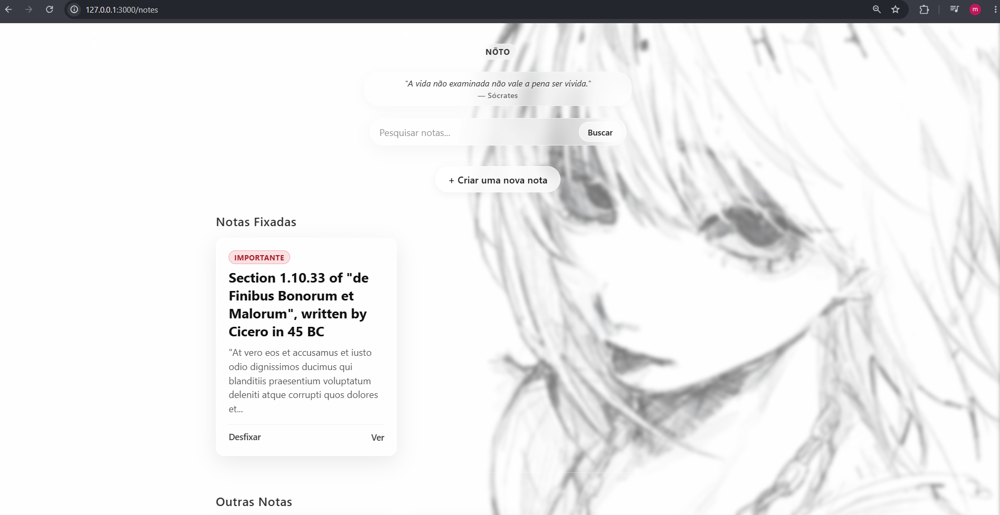

# Nõto Project </>
~ Minimalist, clean, and fast note-taking manager.
The project is also part of my journey learning Ruby on Rails, exploring MVC architecture, Active Record, database migrations, validations, and RESTful routing through practical development.

I relied heavily on AI assistance to build the front-end, as that wasn't the main focus of my learning journey. My primary goal was to learn Ruby on Rails and understand the application's back-end logic. I simply organized a few aspects and structured the page's Ruby code.



## 🛠️ Built With

This project was developed using the following technologies:

* **Ruby** — my favorite language
* **Ruby on Rails** — A fucking awesome framework
* **Active Record** — Object-relational mapping (ORM) for database management.
* **SQLite** —  self-contained relational database.

---

## 🚀 Getting Started

1. **Clone the repository:**
   ```bash
   git clone https://github.com/iblamemateus/Noto
   cd Noto
   ```

2. **Install the dependencies:**
   ```bash
   bundle install
   ```

3. **Prepare the database:**
   ```bash
   bin/rails db:prepare
   ```

4. **Start the development server:**
   ```bash
   bin/rails server
   ```
open your browser and navigate to: [http://localhost:3000](http://localhost:3000)
